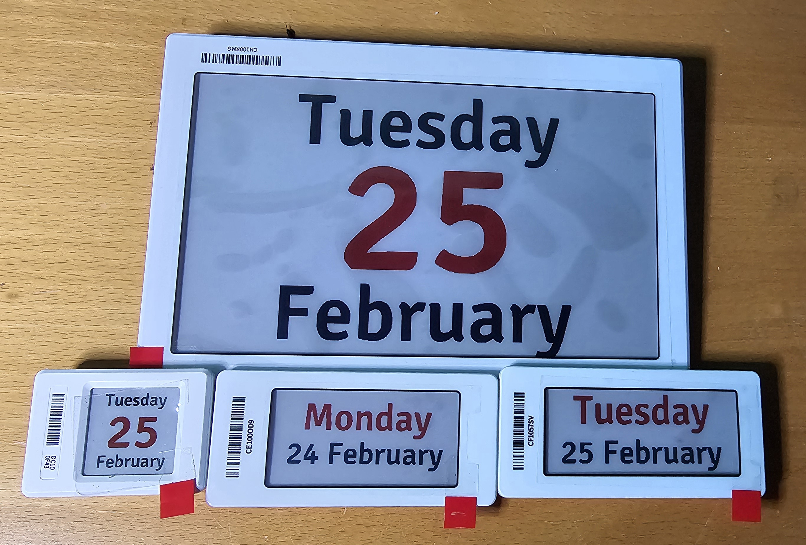
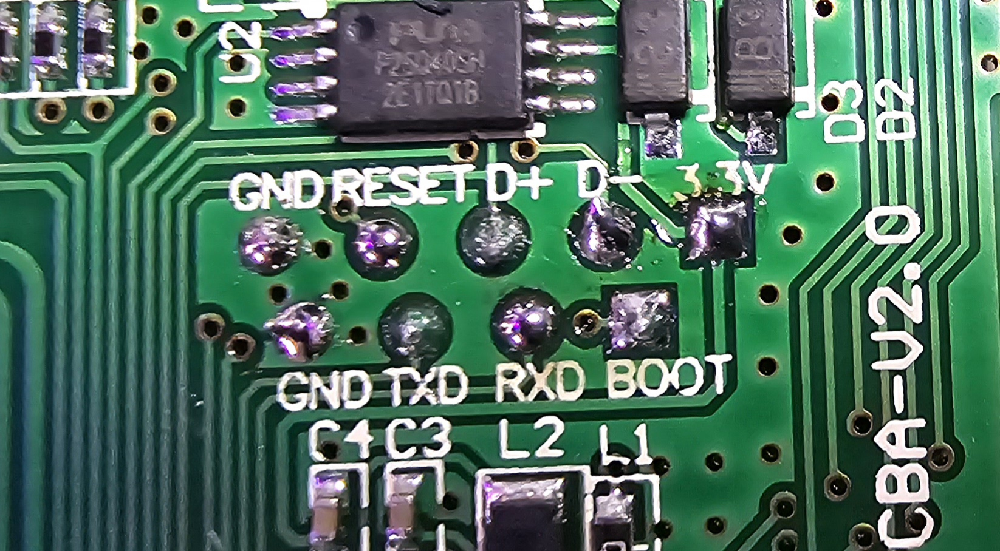

# ATC BLE OEPL for WCH CH573F 

## Yalatech Yalabi E-Paper BLE Displays

This firmware can be used with the ATC BLE OEPL WebTool:
https://atc1441.github.io/ATC_BLE_OEPL_Image_Upload.html

As well as an OpenEpaperLink BLE Access Point:
https://github.com/OpenEPaperLink/OpenEPaperLink

Use the provided WCHISPTool to flash the CH573F SoC

### To flash the Display connect:

Boot pin to GND

USB D+ to D+

USB D- to D-

USB GND to GND 

and then connect the battery, the WCHISPTool will detect the device and this allows you to flash the fitting firmware

### To compile your own version use the MounRiver Studio to open the firmware project.

